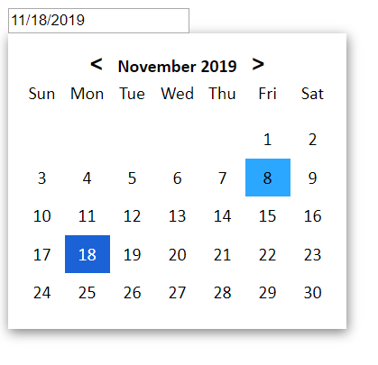

# Carbox Date-Picker
A tiny zero-dependency and framework-agnostic date picker that is incredibly easy to use! Compatible with any web UI framework, vanilla JS projects, and even HTML-only projects!



## Features

- carbox-picker is a **Web Component**. It is EXTREMELY EASY to use! You can simply import the JS bundle and use the tag `<carbox-picker></carbox-picker>` and you're all set!
- You can use carbox even if you only have HTML only! You do not need any Javscript code and without having to use any framework!
- **Zero Dependencies**: This was completely written with vanilla JS without any frameworks or dependencies!
- **Extremely Lightweight**: The webpack bundle is only 4kb even before zipping.
- **Frontend Framework Agnostic**: You can use carbox with any web UI framework! In fact, it can be used without a framework at all!
- Can be interfaced just like a regular `<input>` which allows easy integration with forms, refs, etc.

## Getting Started
### Importing as a Dependency

You can import carbox into a javascript file as a dependency. First, install it as a dependency using your favorite JS dependency manager, such as `npm`, `yarn` or `pnpm`. `npm` example:
```
npm install carbox-date-picker
```

Then import it using one of the following methods:

**ES6 modules**
```
import picker from 'carbox-date-picker'
```
**CommonJS modules**
```
require('carbox-date-picker')
```

### Import The Bundled Script into HTML
Alternatively, you may build a minified bundle and import it as a script into your HTML file. This is especially useful if you are working on a small project or are not using Javascript!

- First, clone this repo:
```
git clone https://gitlab.com/oxamide/carbox-date-picker.git && cd carbox-date-picker
```
- install the project dev dependencies
```
npm ci
```
- build the minified bundle
```
npm run build
```
- The bundle will be created in a folder called `lib` and will be called `index.js`. You can customize this by editing `webpack.config.js`.
- Copy the bundle over to your project
- Iport the bundle to your HTML file as follows.
```
<script src={path to script}></script>
```
- you're all set to start using it!


### Usage
To use carbox date picker, simply use the `<carbox-picker>` tag in your HTML. No Javascript needed at all!
```
<carbox-picker></carbox-picker>
```

## Status
carbox-picker is in beta phase. In other words, while it is very usable, it was tested in limited scenarios, so use in critical production environments is not advised.

stay tuned as more users test carbox-picker and more features get added!

## Contribution
Contributions are very welcome and encouraged!

- Find an open issue in the issues section. Look for something that is interesting to you and you think you can work on!
- Alternatively, feel free to open an issue for any bugs or any suggested or requested features
- Comment on the issue indicating your willingness to work on it. Make sure no one else has done it yet!
- You can start working on the feature / bug fix immediately, no need to wait for approval
- Feel free to open draft pull request (PR) before it is ready while you're working on it. You may ask clarifying question or ask for help on the way
